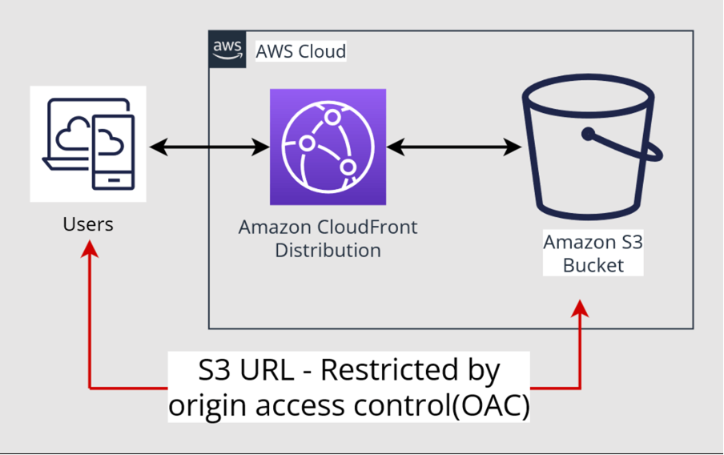

# Simple HTML page hosting solution written in CDKTF

This is an IaC project written using CDKTF, responsible for creating all necessary resources to host a simple static HTML page. The entire solution is based on AWS public cloud.

By combining services such as CloudFront and S3, we achieve a highly efficient and secure hosting solution for our website, making this approach a preferred choice.

To ensure that access to the website is only possible through the CloudFront Endpoint, the Origin Access Control (OAC) option has been implemented. The S3 bucket is private and, apart from the CloudFront instance, no other access to its resources is allowed.

## Simplified Architecture Diagram:



## Assumptions:

- Must be routable via HTTPS only (access through HTTPS enforced through permanent redirection of any HTTP request).
- Must use CDKTF as infrastructure as code (Python language used).
- Zero Click Ops approach (After `cdktf deploy` is finished, the page is available through the URL provided in the output).
- DNS routing is not required (the default CloudFront domain is used along with its default CloudFront SSL certificate).

## Environment Setup:

### Prerequisites:

- Terraform CLI installed (1.2+)
- Node.js and npm v16+
- Python (Project created with version 3.11)
- Pipenv (Project created with version 2024.4.1)
- AWS CLI properly configured to access your chosen AWS account

### Installing Required Tools:

#### Install CDKTF:
```sh
npm install --global cdktf-cli@latest
```

### Deploying the Solution:

#### Clone the repository:
```sh
git clone https://github.com/Krolik23/static-page-hosting.git
```

#### Navigate to the repository, install necessary dependencies, retrieve required modules, and check the planned resource changes:
```sh
cd static-page-hosting && pipenv install cdktf && cdktf get && cdktf diff
```

#### Deploy the infrastructure. Once `cdktf apply` completes, the output will provide the CloudFront URL hosting the static page:
```sh
cdktf apply
```
